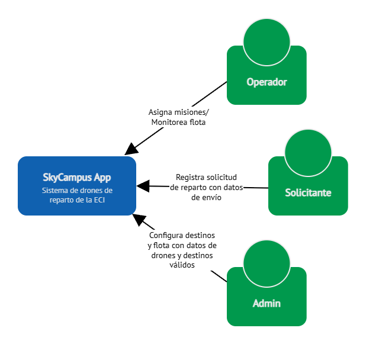

# **Chimchar - SkyCampus MVP**

- **Nombre:** Cristian Camilo Ortiz Sánchez
- **Carnet:** 1000105286
- **Correo:** `cristian.ortiz-s@mail.escuelaing.edu.co`
---

**Contexto:** La ECI tiene 5 drones del mismo modelo (DJI Mini 3). Solo transportan documentos (sobres y carpetas). Los destinos posibles son fijos: Bloque A, Bloque B, Bloque C, Bloque D y la Biblioteca. Un operador selecciona manualmente qué drone asignar a cada misión.

**Flujo básico:** El operador registra una solicitud de reparto (origen, destino, tipo de documento) → revisa qué drones están disponibles y con batería suficiente → asigna uno manualmente → el drone ejecuta la misión por ruta predefinida → el operador confirma la entrega.

**Los objetos del sistema:**

`Drone(id:String, modelo:String, bateria:int, disponible:boolean, ubicacion:String)`

`Mision(id:String, drone:Drone, origen:String, destino:String tipoCarga:TipoCarga, estado:EstadoMision)`

`TipoCarga: Enum(SOBRE, CARPETA, LIBRO)   EstadoMision: Enum(PENDIENTE EN_VUELO, ENTREGADA, FALLIDA)`

---

## 01 · STREAMS & LAMBDAS
### Filtrar y ordenar la flota de drones disponibles

#### 1. Lista de IDs de drones disponibles con batería ≥50%, ordenados de mayor a menor batería.

```java
List<String> primeraConsulta = flota.stream()
    .filter(d -> d.bateria() >= 50 && d.disponible())
    .sorted(Comparator.comparing(Drone::bateria).reversed())
    .map(Drone::id)
    .toList();
```

#### 2. ¿Hay algún drone disponible ubicado en "Bloque C"?
```java
boolean segundaConsulta = flota.stream()
    .anyMatch(p -> p.ubicacion().equals("Bloque C") && p.disponible());   
```
#### 3. Cuántos drones tienen batería crítica (menos del 20%), independientemente de su disponibilidad.
```java
long terceraConsulta = flota.stream()
    .filter(p -> p.bateria() < 20)
    .count();
```
#### 4. Lista con el ID y la batería de cada drone (formato "D-01: 85%"), para todos los drones.

```java
List<String> cuartaConsulta = flota.stream()
    .map(d -> d.id() + ": " + d.bateria() + "%")
    .toList();
```

### Respuesta del agente:

> **━━━━━━━━━━━━━━━━━━━━━━━━━━━━━━━━**  
> **REVISIÓN — SkyCampus [Chimchar]**  
> **Reto:** Reto 1 — 4 consultas sobre la flota  
> **━━━━━━━━━━━━━━━━━━━━━━━━━━━━━━━━**  
>  
> **ESTADO: APROBADO ✅**  
>  
> **Lo que está bien:**  
>  
> Corregiste la comparación de cadenas usando `.equals()` en lugar de `==`, asegurando la evaluación por contenido.  
>  
> El pipeline de Streams en cada consulta es correcto, conciso y utiliza las operaciones intermedias y terminales adecuadas.  
>  
> Cumple estrictamente con el nivel Chimchar: sin bucles `for`/`while`, compila perfectamente y resuelve las 4 consultas solicitadas.  
>  
> Antes de avanzar, responde estas preguntas sin mirar el código:  
>  
> 1. En la consulta 2, ¿por qué es computacionalmente más eficiente usar `anyMatch()` que hacer un `filter()` seguido de un `findFirst().isPresent()` o `count() > 0`?  
>  
> 2. Si intentáramos guardar el `Stream<Drone>` en una variable local y ejecutar la consulta 1 y la consulta 2 sobre esa misma variable, ¿qué excepción lanzaría Java en tiempo de ejecución y por qué?  
>  
> **━━━━━━━━━━━━━━━━━━━━━━━━━━━━━━━━**
---

## 02 · GITHUB Y GITFLOW
### Crear el repositorio de SkyCampus con flujo correcto

#### Link del REPO: https://github.com/CatrachoINXS/SkyCampus-ECI-Ortiz.git

> **━━━━━━━━━━━━━━━━━━━━━━━━━━━━━━━━**  
> **REVISIÓN — SkyCampus [Chimchar]**  
> **Reto:** Configuración de Git, GitFlow y Modelo Inicial  
> **━━━━━━━━━━━━━━━━━━━━━━━━━━━━━━━━**  
>  
> **ESTADO: APROBADO ✅**  
>  
> **Lo que está bien:**  
>  
> La estructura de ramas respeta la convención de GitFlow (`main`, `develop` y la rama de característica `feature/Ortiz-modelo-drone`).  
>  
> La historia de commits es atómica, secuencial y sigue el estándar de Conventional Commits (`feat:`).  
>  
> El grafo de Git confirma que la integración (*merge*) hacia la rama `develop` se realizó correctamente partiendo del commit inicial de `main`.  
>  
> **━━━━━━━━━━━━━━━━━━━━━━━━━━━━━━━━**

---

## 03 · PATRONES DE DISEÑO
### Elegir el patrón correcto para cada problema de SkyCampus MVP

**Problema 1:**  Una `Mision` tiene campos obligatorios (drone, origen, destino) y opcionales (prioridad, notas del operador, hora máxima de entrega). Crear un constructor para cada combinación es insostenible y confuso.

#### **(a) PATRON BUILDER:** (b) Porque construye paso a paso solo los campos necesarios para una misión.

#### (c) Implementación de la estructura mínima en Java

```java
public class MisionBuilder {

    private Drone drone;
    private String origen, destino, id;
    private TipoCarga tipoCarga;

    private EstadoMision estadoMision = EstadoMision.PENDIENTE;
    private LocalTime horaMaxima;
    private String notas = "";
    private int prioridad = 3;

    public MisionBuilder id(String id) { this.id = id; return this; }
    public MisionBuilder drone(Drone drone) { this.drone = drone; return this; }
    public MisionBuilder origen(String origen) { this.origen = origen; return this; }
    public MisionBuilder destino(String destino) { this.destino = destino; return this; }
    public MisionBuilder tipoCarga(TipoCarga carga) { this.tipoCarga = carga; return this; }

    public MisionBuilder horaMaxima(LocalTime hora) { this.horaMaxima = hora; return this; }
    public MisionBuilder notas(String nota)   { this.notas = nota;  return this; }

    public Mision build() {
        if (origen == null || destino == null || drone == null) {
            throw new IllegalStateException("Drone, origen y destino son obligatorios");
        }
        return new Mision(id, drone, origen, destino, tipoCarga, estadoMision, prioridad, notas, horaMaxima);
    }

}

// ———————— Uso ———————————————————————————————————————————————————————

    Mision m = new MisionBuilder()
        .drone(d03).origen("Bloque C").destino("Biblioteca")
        .tipoCarga(TipoCarga.SOBRE)
        .horaMaxima(LocalTime.of(6, 20))
        .notas("Urgente Examen mañana")
        .build();
     
```

**Problema 2:** Antes de lanzar el drone, el sistema debe validar en orden: (a) ¿el drone tiene batería suficiente? (b) ¿el destino es válido? (c) ¿la carga no supera el peso máximo? Cada validación decide si pasa o rechaza.

#### **(a) PATRON CHAIN OF RESPONSIBILITY:** (b) Porque cada validador procesa la batería, el destino y la carga de manera secuencial.

#### (c) Implementación de la estructura mínima en Java

```java
public interface Validator {
    Validator setNext(Validator validator);
    void validate(Mision mision);
}


public abstract class BaseValidator implements Validator {
    
    private Validator next;

    @Override 
    public Validator setNext(Validator validator) {
        this.next = validator;
        return validator;
    }

    protected void nextValidator(Mision mision) {
        if (next != null) {
            this.next.validate(mision);
        }
    }

}


public class ValidadorBateria extends BaseValidator {

    @Override
    public void validate(Mision mision) {
        if (mision.drone().bateria() < 30) {
            throw new IllegalArgumentException("El drone no tiene batería suficiente");
        }
        System.out.println("[ValidadorBateria] Batería suficiente");
        nextValidator(mision);
    }
    
}


public class ValidadorDestino extends BaseValidator {

    private List<String> destinosValidos = List.of(
        "Bloque A", "Bloque B", "Bloque C", "Bloque D", "Biblioteca"
    );

    @Override
    public void validate(Mision mision) {
        if (!destinosValidos.contains(mision.destino())) {
            throw new IllegalArgumentException("El destino no es válido");
        }
        System.out.println("[ValidadorDestino] Destino válido");
        nextValidator(mision);
    }
    
}


public class ValidadorCarga extends BaseValidator {

    @Override
    public void validate(Mision mision) {

        TipoCarga tipoCarga = mision.tipoCarga();
        if (mision.drone().modelo().equals("DJI Mini 3") && (
            !tipoCarga.equals(TipoCarga.SOBRE) && !tipoCarga.equals(TipoCarga.CARPETA))) {

            throw new IllegalArgumentException("La carga supera el peso máximo");
        }
    }
    
}

// ———————— Uso ———————————————————————————————————————————————————————

    Validator chain = new ValidadorBateria();
    chain.setNext(new ValidadorDestino())
        .setNext(new ValidadorCarga());
     
    chain.validate(mision);
```


**Problema 3:** El sistema debe asignar el drone óptimo para cada misión. El MVP asigna el de mayor batería. En el futuro podría ser el más cercano, o el más rápido. El algoritmo debe ser intercambiable sin tocar el resto del código.

#### **(a) PATRON STRATEGY:** (b) Porque el sistema debe intercambiar el algoritmo para escoger el dron óptimo sin estár acoplado a cada implementación.

#### (c) Implementación de la estructura mínima en Java

```java
public class SkyCampus {
    
    private DroneSelectionStrategy strategy = new HighestBatteryStrategy();

    List<Drone> flota = List.of(
        new Drone("D-01", "DJI Mini 3", 85, true,  "Bloque A"),
        new Drone("D-02", "DJI Mini 3", 42, false, "Biblioteca"),
        new Drone("D-03", "DJI Mini 3", 91, true,  "Bloque C"),
        new Drone("D-04", "DJI Mini 3", 18, true,  "Bloque B"),
        new Drone("D-05", "DJI Mini 3", 67, true,  "Bloque D")
    );

    public Drone selectDrone() {
        return this.strategy.selectDrone(flota);
    }

    public void setDroneSelectionStrategy(DroneSelectionStrategy strategy) {
        this.strategy = strategy;
    }
}


public interface DroneSelectionStrategy {
    Drone selectDrone(List<Drone> drones);
}


public class HighestBatteryStrategy implements DroneSelectionStrategy {

    @Override
    public Drone selectDrone(List<Drone> drones) {
        if(drones.isEmpty()) {
            throw new IllegalArgumentException("No hay drones para seleccionar");
        }
        return drones.stream()
            .max(Comparator.comparing(Drone::bateria))
            .get();
    }
    
}

// ———————— Uso ———————————————————————————————————————————————————————

    SkyCampus service = new SkyCampus();
    service.setDroneSelectionStrategy(new HighestBatteryStrategy());
    
    Drone dron = service.selectDrone();

```

### Respuesta del agente:

> **━━━━━━━━━━━━━━━━━━━━━━━━━━━━━━━━**  
> **REVISIÓN — SkyCampus [Chimchar]**  
> **Reto:** Reto 3 — Patrones de Diseño (Builder, Chain of Responsibility, Strategy)  
> **━━━━━━━━━━━━━━━━━━━━━━━━━━━━━━━━**  
>  
> **ESTADO: APROBADO ✅**  
>  
> **Lo que está bien:**  
>  
> **MisionBuilder:** Corregiste los nombres de parámetros, utilizaste `LocalTime.of(...)` y arreglaste la firma del constructor enviando el atributo id obligatorio.  
>  
> **Chain of Responsibility:** Corregiste la condición lógica booleana en `ValidadorCarga` mediante la conjunción `&& (!SOBRE && !CARPETA)`, haciendo que la regla de peso/carga funcione correctamente.  
>  
> **Strategy:** Eliminaste el retorno de null manejando explícitamente el caso de lista vacía con una excepción descriptiva (`IllegalArgumentException`).  
>  
> **━━━━━━━━━━━━━━━━━━━━━━━━━━━━━━━━**

## 04 · PRINCIPIOS SOLID
### El GestorDrone viola SOLID

|PRINCIPIO|PORQUÉ VIOLA EL PRINCIPIO|
|---|---|
|**Single Responsibility**|La clase tiene muchas responsabilidades, asigna misiones, guarda en base de datos, genera reportes, etc.|
|**Open/Closed**|El condicional del método calcular ruta debe modificarse a medida que se quieren implementar nuevas funcionalidades, por lo tanto es abierto para la modificacion y cerrado para la extension.|
|**Dependency Inversion**|La clase está acomplada a implementaciones concretas como MySQL y no a abstracciones como Base de Datos|

### Rediseño de la implementación usando los principios SOLID

```java
public class AsignadorMision {
    
    public void asignarMision(Drone dron, Mision mision) {
        // lógica de asignación
    }
}


public interface RepositorioMision {
    void guardarEnBD(Mision mision);
}


public interface AlertaOperador {
    void enviarAlerta(String msg);
}


public class GeneradorReporte {
    
     public void generarReportePDF(List<Mision> misiones) {
        // genera PDF con iText aquí
    }
}

public interface EstrategiaRuta {
    void calcularRuta(String origen, String destino);
}


public class EstrategiaRutaDirecta implements EstrategiaRuta {

    @Override
    public void calcularRuta(String origen, String destino) {
        // Calcula la ruta directa
    }
    
}


public class EstrategiaRutaEvitar implements EstrategiaRuta {

    @Override
    public void calcularRuta(String origen, String destino) {
        // Evita los edificios altos
    }
    
}
```
### Respuesta del agente: 

> **━━━━━━━━━━━━━━━━━━━━━━━━━━━━━━━━**  
> **REVISIÓN — SkyCampus [Chimchar]**  
> **Reto:** Reto 4 — Principios SOLID y Refactorización  
> **━━━━━━━━━━━━━━━━━━━━━━━━━━━━━━━━**  
>  
> **ESTADO: APROBADO ✅**  
>  
> **Lo que está bien:**  
>  
> **Identificación de violaciones SOLID:** Identificaste de manera precisa las tres violaciones principales (SRP, OCP y DIP) explicando adecuadamente la causa en el código original.  
>  
> **Refactorización modular (SRP):** Desacoplaste correctamente la clase monolítica GestorDrone en clases e interfaces cohesivas, asegurando que cada una tenga una sola responsabilidad y razón para cambiar.  
>  
> **Inversión de Dependencias (DIP) y OCP:** Al convertir la persistencia y la alerta a interfaces (RepositorioMision y AlertaOperador), desacoplaste las implementaciones concretas. Además, el uso de la interfaz EstrategiaRuta reemplazó el bloque if/else por polimorfismo, permitiendo extender nuevos tipos de ruta sin modificar el código existente.  
>  
> **Cumplimiento de estándares de código:** Los nombres siguen las convenciones en Java (PascalCase, camelCase) y la longitud de los métodos y clases está dentro de los límites del nivel Chimchar.  
>  
> **━━━━━━━━━━━━━━━━━━━━━━━━━━━━━━━━**

---

## 05 · DIAGRAMA DE CONTEXTO C4
### Cómo encaja SkyCampus MVP en el mundo de la ECI




