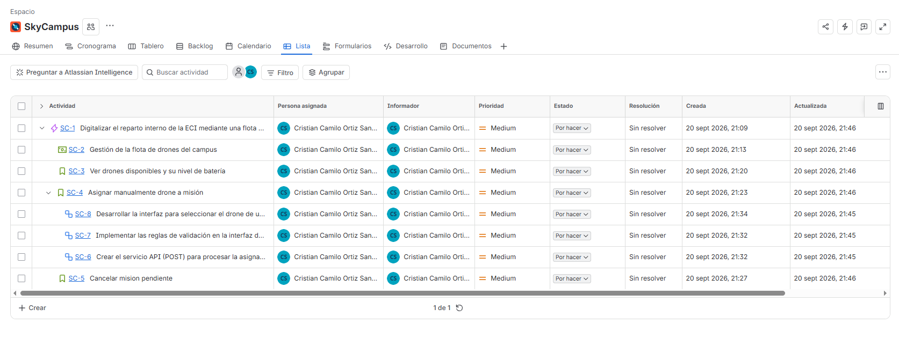
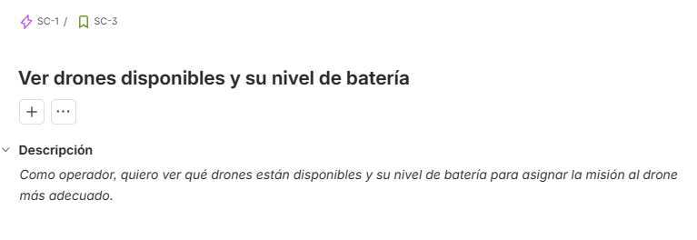
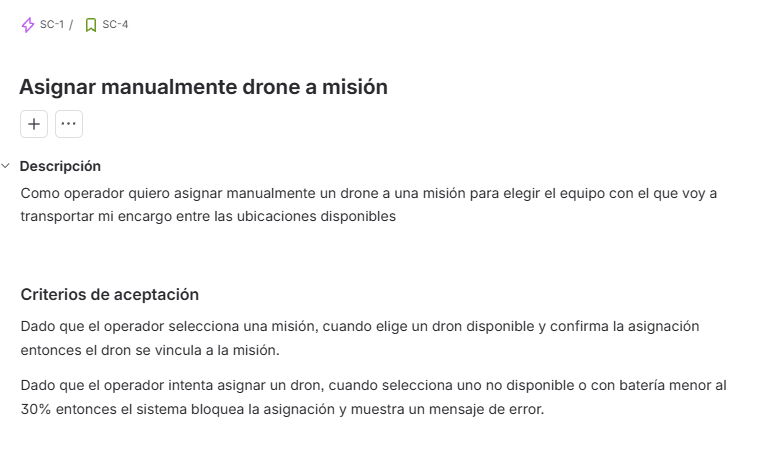
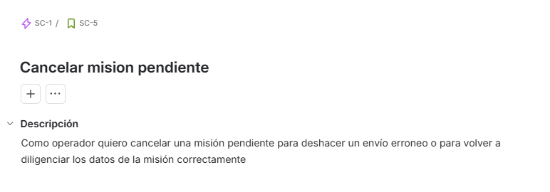
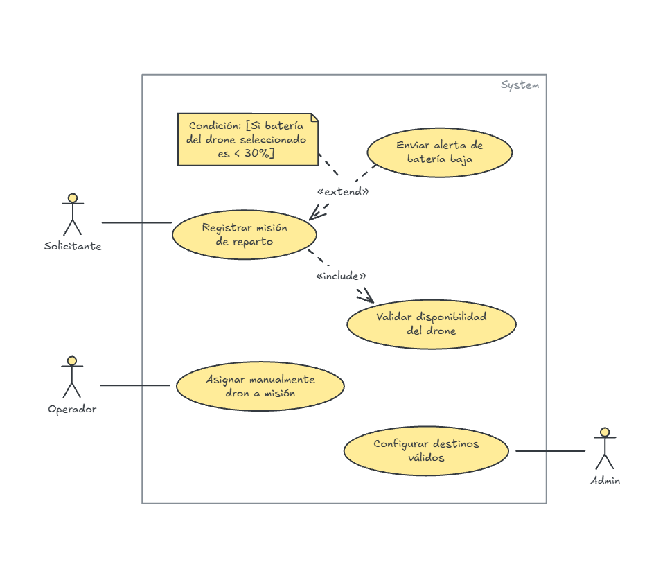
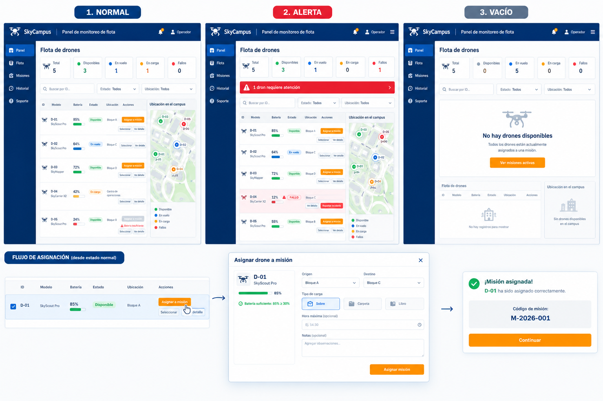

# **Chimchar - SkyCampus MVP**

- **Nombre:** Cristian Camilo Ortiz Sánchez
- **Carnet:** 1000105286
- **Correo:** `cristian.ortiz-s@mail.escuelaing.edu.co`
---

**Contexto:** La ECI tiene 5 drones del mismo modelo (DJI Mini 3). Solo transportan documentos (sobres y carpetas). Los destinos posibles son fijos: Bloque A, Bloque B, Bloque C, Bloque D y la Biblioteca. Un operador selecciona manualmente qué drone asignar a cada misión.

**Flujo básico:** El operador registra una solicitud de reparto (origen, destino, tipo de documento) → revisa qué drones están disponibles y con batería suficiente → asigna uno manualmente → el drone ejecuta la misión por ruta predefinida → el operador confirma la entrega.

**Los objetos del sistema:**

`Drone(id:String, modelo:String, bateria:int, disponible:boolean, ubicacion:String)`

`Mision(id:String, drone:Drone, origen:String, destino:String tipoCarga:TipoCarga, estado:EstadoMision)`

`TipoCarga: Enum(SOBRE, CARPETA, LIBRO)   EstadoMision: Enum(PENDIENTE EN_VUELO, ENTREGADA, FALLIDA)`

---

## 01 · STREAMS & LAMBDAS
### Filtrar y ordenar la flota de drones disponibles

#### 1. Lista de IDs de drones disponibles con batería ≥50%, ordenados de mayor a menor batería.

```java
List<String> primeraConsulta = flota.stream()
    .filter(d -> d.bateria() >= 50 && d.disponible())
    .sorted(Comparator.comparing(Drone::bateria).reversed())
    .map(Drone::id)
    .toList();
```

#### 2. ¿Hay algún drone disponible ubicado en "Bloque C"?
```java
boolean segundaConsulta = flota.stream()
    .anyMatch(p -> p.ubicacion().equals("Bloque C") && p.disponible());   
```
#### 3. Cuántos drones tienen batería crítica (menos del 20%), independientemente de su disponibilidad.
```java
long terceraConsulta = flota.stream()
    .filter(p -> p.bateria() < 20)
    .count();
```
#### 4. Lista con el ID y la batería de cada drone (formato "D-01: 85%"), para todos los drones.

```java
List<String> cuartaConsulta = flota.stream()
    .map(d -> d.id() + ": " + d.bateria() + "%")
    .toList();
```

### Respuesta del agente:

> **━━━━━━━━━━━━━━━━━━━━━━━━━━━━━━━━**  
> **REVISIÓN — SkyCampus [Chimchar]**  
> **Reto:** Reto 1 — 4 consultas sobre la flota  
> **━━━━━━━━━━━━━━━━━━━━━━━━━━━━━━━━**  
>  
> **ESTADO: APROBADO ✅**  
>  
> **Lo que está bien:**  
>  
> Corregiste la comparación de cadenas usando `.equals()` en lugar de `==`, asegurando la evaluación por contenido.  
>  
> El pipeline de Streams en cada consulta es correcto, conciso y utiliza las operaciones intermedias y terminales adecuadas.  
>  
> Cumple estrictamente con el nivel Chimchar: sin bucles `for`/`while`, compila perfectamente y resuelve las 4 consultas solicitadas.  
>  
> Antes de avanzar, responde estas preguntas sin mirar el código:  
>  
> 1. En la consulta 2, ¿por qué es computacionalmente más eficiente usar `anyMatch()` que hacer un `filter()` seguido de un `findFirst().isPresent()` o `count() > 0`?  
>  
> 2. Si intentáramos guardar el `Stream<Drone>` en una variable local y ejecutar la consulta 1 y la consulta 2 sobre esa misma variable, ¿qué excepción lanzaría Java en tiempo de ejecución y por qué?  
>  
> **━━━━━━━━━━━━━━━━━━━━━━━━━━━━━━━━**
---

## 02 · GITHUB Y GITFLOW
### Crear el repositorio de SkyCampus con flujo correcto

#### Link del REPO: https://github.com/CatrachoINXS/SkyCampus-ECI-Ortiz.git

> **━━━━━━━━━━━━━━━━━━━━━━━━━━━━━━━━**  
> **REVISIÓN — SkyCampus [Chimchar]**  
> **Reto:** Configuración de Git, GitFlow y Modelo Inicial  
> **━━━━━━━━━━━━━━━━━━━━━━━━━━━━━━━━**  
>  
> **ESTADO: APROBADO ✅**  
>  
> **Lo que está bien:**  
>  
> La estructura de ramas respeta la convención de GitFlow (`main`, `develop` y la rama de característica `feature/Ortiz-modelo-drone`).  
>  
> La historia de commits es atómica, secuencial y sigue el estándar de Conventional Commits (`feat:`).  
>  
> El grafo de Git confirma que la integración (*merge*) hacia la rama `develop` se realizó correctamente partiendo del commit inicial de `main`.  
>  
> **━━━━━━━━━━━━━━━━━━━━━━━━━━━━━━━━**

---

## 03 · PATRONES DE DISEÑO
### Elegir el patrón correcto para cada problema de SkyCampus MVP

**Problema 1:**  Una `Mision` tiene campos obligatorios (drone, origen, destino) y opcionales (prioridad, notas del operador, hora máxima de entrega). Crear un constructor para cada combinación es insostenible y confuso.

#### **(a) PATRON BUILDER:** (b) Porque construye paso a paso solo los campos necesarios para una misión.

#### (c) Implementación de la estructura mínima en Java

```java
public class MisionBuilder {

    private Drone drone;
    private String origen, destino, id;
    private TipoCarga tipoCarga;

    private EstadoMision estadoMision = EstadoMision.PENDIENTE;
    private LocalTime horaMaxima;
    private String notas = "";
    private int prioridad = 3;

    public MisionBuilder id(String id) { this.id = id; return this; }
    public MisionBuilder drone(Drone drone) { this.drone = drone; return this; }
    public MisionBuilder origen(String origen) { this.origen = origen; return this; }
    public MisionBuilder destino(String destino) { this.destino = destino; return this; }
    public MisionBuilder tipoCarga(TipoCarga carga) { this.tipoCarga = carga; return this; }

    public MisionBuilder horaMaxima(LocalTime hora) { this.horaMaxima = hora; return this; }
    public MisionBuilder notas(String nota)   { this.notas = nota;  return this; }

    public Mision build() {
        if (origen == null || destino == null || drone == null) {
            throw new IllegalStateException("Drone, origen y destino son obligatorios");
        }
        return new Mision(id, drone, origen, destino, tipoCarga, estadoMision, prioridad, notas, horaMaxima);
    }

}

// ———————— Uso ———————————————————————————————————————————————————————

    Mision m = new MisionBuilder()
        .drone(d03).origen("Bloque C").destino("Biblioteca")
        .tipoCarga(TipoCarga.SOBRE)
        .horaMaxima(LocalTime.of(6, 20))
        .notas("Urgente Examen mañana")
        .build();
     
```

**Problema 2:** Antes de lanzar el drone, el sistema debe validar en orden: (a) ¿el drone tiene batería suficiente? (b) ¿el destino es válido? (c) ¿la carga no supera el peso máximo? Cada validación decide si pasa o rechaza.

#### **(a) PATRON CHAIN OF RESPONSIBILITY:** (b) Porque cada validador procesa la batería, el destino y la carga de manera secuencial.

#### (c) Implementación de la estructura mínima en Java

```java
public interface Validator {
    Validator setNext(Validator validator);
    void validate(Mision mision);
}


public abstract class BaseValidator implements Validator {
    
    private Validator next;

    @Override 
    public Validator setNext(Validator validator) {
        this.next = validator;
        return validator;
    }

    protected void nextValidator(Mision mision) {
        if (next != null) {
            this.next.validate(mision);
        }
    }

}


public class ValidadorBateria extends BaseValidator {

    @Override
    public void validate(Mision mision) {
        if (mision.drone().bateria() < 30) {
            throw new IllegalArgumentException("El drone no tiene batería suficiente");
        }
        System.out.println("[ValidadorBateria] Batería suficiente");
        nextValidator(mision);
    }
    
}


public class ValidadorDestino extends BaseValidator {

    private List<String> destinosValidos = List.of(
        "Bloque A", "Bloque B", "Bloque C", "Bloque D", "Biblioteca"
    );

    @Override
    public void validate(Mision mision) {
        if (!destinosValidos.contains(mision.destino())) {
            throw new IllegalArgumentException("El destino no es válido");
        }
        System.out.println("[ValidadorDestino] Destino válido");
        nextValidator(mision);
    }
    
}


public class ValidadorCarga extends BaseValidator {

    @Override
    public void validate(Mision mision) {

        TipoCarga tipoCarga = mision.tipoCarga();
        if (mision.drone().modelo().equals("DJI Mini 3") && (
            !tipoCarga.equals(TipoCarga.SOBRE) && !tipoCarga.equals(TipoCarga.CARPETA))) {

            throw new IllegalArgumentException("La carga supera el peso máximo");
        }
    }
    
}

// ———————— Uso ———————————————————————————————————————————————————————

    Validator chain = new ValidadorBateria();
    chain.setNext(new ValidadorDestino())
        .setNext(new ValidadorCarga());
     
    chain.validate(mision);
```


**Problema 3:** El sistema debe asignar el drone óptimo para cada misión. El MVP asigna el de mayor batería. En el futuro podría ser el más cercano, o el más rápido. El algoritmo debe ser intercambiable sin tocar el resto del código.

#### **(a) PATRON STRATEGY:** (b) Porque el sistema debe intercambiar el algoritmo para escoger el dron óptimo sin estár acoplado a cada implementación.

#### (c) Implementación de la estructura mínima en Java

```java
public class SkyCampus {
    
    private DroneSelectionStrategy strategy = new HighestBatteryStrategy();

    List<Drone> flota = List.of(
        new Drone("D-01", "DJI Mini 3", 85, true,  "Bloque A"),
        new Drone("D-02", "DJI Mini 3", 42, false, "Biblioteca"),
        new Drone("D-03", "DJI Mini 3", 91, true,  "Bloque C"),
        new Drone("D-04", "DJI Mini 3", 18, true,  "Bloque B"),
        new Drone("D-05", "DJI Mini 3", 67, true,  "Bloque D")
    );

    public Drone selectDrone() {
        return this.strategy.selectDrone(flota);
    }

    public void setDroneSelectionStrategy(DroneSelectionStrategy strategy) {
        this.strategy = strategy;
    }
}


public interface DroneSelectionStrategy {
    Drone selectDrone(List<Drone> drones);
}


public class HighestBatteryStrategy implements DroneSelectionStrategy {

    @Override
    public Drone selectDrone(List<Drone> drones) {
        if(drones.isEmpty()) {
            throw new IllegalArgumentException("No hay drones para seleccionar");
        }
        return drones.stream()
            .max(Comparator.comparing(Drone::bateria))
            .get();
    }
    
}

// ———————— Uso ———————————————————————————————————————————————————————

    SkyCampus service = new SkyCampus();
    service.setDroneSelectionStrategy(new HighestBatteryStrategy());
    
    Drone dron = service.selectDrone();

```

### Respuesta del agente:

> **━━━━━━━━━━━━━━━━━━━━━━━━━━━━━━━━**  
> **REVISIÓN — SkyCampus [Chimchar]**  
> **Reto:** Reto 3 — Patrones de Diseño (Builder, Chain of Responsibility, Strategy)  
> **━━━━━━━━━━━━━━━━━━━━━━━━━━━━━━━━**  
>  
> **ESTADO: APROBADO ✅**  
>  
> **Lo que está bien:**  
>  
> **MisionBuilder:** Corregiste los nombres de parámetros, utilizaste `LocalTime.of(...)` y arreglaste la firma del constructor enviando el atributo id obligatorio.  
>  
> **Chain of Responsibility:** Corregiste la condición lógica booleana en `ValidadorCarga` mediante la conjunción `&& (!SOBRE && !CARPETA)`, haciendo que la regla de peso/carga funcione correctamente.  
>  
> **Strategy:** Eliminaste el retorno de null manejando explícitamente el caso de lista vacía con una excepción descriptiva (`IllegalArgumentException`).  
>  
> **━━━━━━━━━━━━━━━━━━━━━━━━━━━━━━━━**

## 04 · PRINCIPIOS SOLID
### El GestorDrone viola SOLID

|PRINCIPIO|PORQUÉ VIOLA EL PRINCIPIO|
|---|---|
|**Single Responsibility**|La clase tiene muchas responsabilidades, asigna misiones, guarda en base de datos, genera reportes, etc.|
|**Open/Closed**|El condicional del método calcular ruta debe modificarse a medida que se quieren implementar nuevas funcionalidades, por lo tanto es abierto para la modificacion y cerrado para la extension.|
|**Dependency Inversion**|La clase está acomplada a implementaciones concretas como MySQL y no a abstracciones como Base de Datos|

### Rediseño de la implementación usando los principios SOLID

```java
public class AsignadorMision {
    
    public void asignarMision(Drone dron, Mision mision) {
        // lógica de asignación
    }
}


public interface RepositorioMision {
    void guardarEnBD(Mision mision);
}


public interface AlertaOperador {
    void enviarAlerta(String msg);
}


public class GeneradorReporte {
    
     public void generarReportePDF(List<Mision> misiones) {
        // genera PDF con iText aquí
    }
}

public interface EstrategiaRuta {
    void calcularRuta(String origen, String destino);
}


public class EstrategiaRutaDirecta implements EstrategiaRuta {

    @Override
    public void calcularRuta(String origen, String destino) {
        // Calcula la ruta directa
    }
    
}


public class EstrategiaRutaEvitar implements EstrategiaRuta {

    @Override
    public void calcularRuta(String origen, String destino) {
        // Evita los edificios altos
    }
    
}
```
### Respuesta del agente: 

> **━━━━━━━━━━━━━━━━━━━━━━━━━━━━━━━━**  
> **REVISIÓN — SkyCampus [Chimchar]**  
> **Reto:** Reto 4 — Principios SOLID y Refactorización  
> **━━━━━━━━━━━━━━━━━━━━━━━━━━━━━━━━**  
>  
> **ESTADO: APROBADO ✅**  
>  
> **Lo que está bien:**  
>  
> **Identificación de violaciones SOLID:** Identificaste de manera precisa las tres violaciones principales (SRP, OCP y DIP) explicando adecuadamente la causa en el código original.  
>  
> **Refactorización modular (SRP):** Desacoplaste correctamente la clase monolítica GestorDrone en clases e interfaces cohesivas, asegurando que cada una tenga una sola responsabilidad y razón para cambiar.  
>  
> **Inversión de Dependencias (DIP) y OCP:** Al convertir la persistencia y la alerta a interfaces (RepositorioMision y AlertaOperador), desacoplaste las implementaciones concretas. Además, el uso de la interfaz EstrategiaRuta reemplazó el bloque if/else por polimorfismo, permitiendo extender nuevos tipos de ruta sin modificar el código existente.  
>  
> **Cumplimiento de estándares de código:** Los nombres siguen las convenciones en Java (PascalCase, camelCase) y la longitud de los métodos y clases está dentro de los límites del nivel Chimchar.  
>  
> **━━━━━━━━━━━━━━━━━━━━━━━━━━━━━━━━**

---

## 05 · DIAGRAMA DE CONTEXTO C4
### Cómo encaja SkyCampus MVP en el mundo de la ECI


### Respuesta del agente:

> **━━━━━━━━━━━━━━━━━━━━━━━━━━━━━━━━**  
> **REVISIÓN — SkyCampus [Chimchar]**  
> **Reto:** Reto 5 — Diagrama de Contexto C4  
> **━━━━━━━━━━━━━━━━━━━━━━━━━━━━━━━━**  
>  
> **ESTADO: APROBADO ✅**  
>  
> **Lo que está bien:**  
>  
> **Conectores C4:** Corregiste las líneas discontinuas por líneas continuas sólidas con flechas dirigidas al sistema, cumpliendo con la notación estándar C4.  
>  
> **Flujo de datos de entrada:** Especificaste adecuadamente qué información envían los actores al sistema (con datos de envío en Solicitante, y con datos de drones y destinos válidos en Admin).  
>  
> **Simplicidad del MVP:** Mantuviste la arquitectura simple y fiel a los requerimientos del nivel Chimchar sin agregar dependencias externas ni complejidad innecesaria.  
>  
> **━━━━━━━━━━━━━━━━━━━━━━━━━━━━━━━━**
___

## 06 · RF VS RNF Y PRIORIDAD MOSCOW
### Escribir los RF y RNF del SkyCampus MVP correctamente

#### REQUERIMIENTOS FUNCIONALES

|Código|Requerimiento|
|---|---|
|SC-01|El sistema debe permitir al solicitante registrar una solicitud de reparto con los datos del envío generando una nueva misión en estado PENDIENTE|
|SC-02|El sistema debe permitir al operador ver los drones disponibles con su batería actual en una lista filtrada de drones. |
|SC-03|El sistema debe permitir al operador asignar manualmente un dron para realizar una solicitud de reparto mostrando el dron seleccionado. |

**MoSCoW:** Los tres requerimientos funcionales entran en la categoría (Must Have). SC-01 es totalmente necesario para crear misiones que son el nucleo de SkyCampus. SC-02 también es indispensable porque es parte del flujo de selección de drones. SC-03 tambíen es obligatorio porque el operador debe poder seleccionar el dron del envío.

#### REQUERIMIENTOS NO FUNCIONALES

|Código|Requerimiento|
|---|---|
|SC-RNF-01|El tiempo de ejecución de las consultas de drones disponibles debe ser menor a 200ms.|
|SC-RNF-02|Un operador debe ser capaz de completar la asignación de una mision en menos de tres pantallas |
|SC-RNF-03|El sistema debe ofrecer la opción de modo Daltonismo para personas con protanopía, deuteranopía y tritanopía.|

**MoSCoW:** El requerimiento SC-RNF-01 está en la categoría (Should Have) pues es un requerimiento importante pero no imprescendible en una fase de lanzamiento. El requerimiento SC-RNF-02 está en la categoría (Must Have) porque es un requerimiento totalmente necesario de usabilidad. El requerimiento SC-RNF-03 está en la categoría (Could Have) porque es un requerimiento deseable, pero de menor impacto.

### Respuesta del agente:

> **━━━━━━━━━━━━━━━━━━━━━━━━━━━━━━━━**  
> **REVISIÓN — SkyCampus [Chimchar]**  
> **Reto:** Reto 6 — RF vs RNF y Priorización MoSCoW  
> **━━━━━━━━━━━━━━━━━━━━━━━━━━━━━━━━**  
>  
> **ESTADO: APROBADO ✅**  
>  
> **Lo que está bien:**  
>  
> **Estructura Causa-Efecto (Acción-Resultado):** Corregiste la redacción de los 3 Requerimientos Funcionales (SC-01, SC-02, SC-03) incorporando explícitamente el resultado observable del sistema ("generando una nueva misión en estado PENDIENTE", "en una lista filtrada de drones", "mostrando el dron seleccionado"), haciendo que cada RF sea atómico, completo y testeable.  
>  
> **Métricas en RNF:** Los Requerimientos No Funcionales mantienen métricas cuantitativas, concretas y verificables (< 200ms, < 3 pantallas, tipos específicos de acromatopsia/daltonismo).  
>  
> **Priorización MoSCoW Justificada:** Argumentaste adecuadamente la asignación de categorías para cada requerimiento acorde al alcance y prioridades operativas del MVP.  
>  
> **━━━━━━━━━━━━━━━━━━━━━━━━━━━━━━━━**

---

## 07 · PLANTILLA DOSW
### Plantilla DOSW para el RF "Registrar mision de reparto"
#### FUNCIONALIDAD
|Código|SC-01|
|---|---|
|Nombre|Registrar misión de reparto de documento|
|Actor|Operador de drones|
|Precondiciones|Debe existir al menos un drone con batería ≥30% y en estado disponible|

#### DATOS DE ENTRADA

|Nombre|Descripción|Tipo de campo|Reglas/Aplicación|Obligatorio|
|---|---|---|---|---|
|drone|Drone asignado manualmente por el operador|`Drone(id:String, modelo:String, bateria:int, disponible:boolean, ubicacion:String)`|El drone debe estár disponible y tener batería con el 30% o más|Si|
|origen|Punto de partida de la misión de reparto|`String`|Debe ser una ubicación válida definida por el admin|Si|
|destino|Punto de llegada de la misión de reparto|`String`|Debe ser una ubicación válida definida por el admin|Si|
|tipoCarga|Carga que va a transportar el drone en la misión|`Enum(SOBRE,CARPETA,LIBRO)`|Debe ser uno de los tipos de carga definidos: SOBRE, CARPETA o LIBRO|Si|
|horaMaxima|Hora máxima en la que se debe completar la misión|`LocalTime`|Debe ser posterior a la hora actual|No|
|notas|Notas agregadas por el operador|`String`|—|No|


#### DATOS DE SALIDA

|Nombre|Descripción|Tipo de campo|Reglas/Aplicación|Obligatorio|
|---|---|---|---|---|
|codigo|Código de la misión generado|`String`|—|Si|

#### FLUJO BÁSICO

|Paso|Actor|Descripción|Excepciones|
|---|---|---|---|
|1|Operador|Ingresa a la opción de registrar misión de reparto|—|
|2|Operador|Ingresa los datos del origen, el destino y el tipo de carga|—|
|3|Sistema|Muestra los drones disponibles que tienen batería mayor al 30%|Flujo alterno 1|
|4|Operador|Selecciona el drone y confirma el registro de la misión|—|
|5|Sistema|Valida los datos ingresados y devuelve el id de la misión|Flujo alterno 2|

#### FLUJO ALTERNO

|Paso|Actor|Descripción|Excepciones|
|---|---|---|---|
|FA-1|Sistema|Cuando no hay drones disponibles o que tengan batería mayor al 30% se lanza una excepción con un mensaje de error indicando el problema y regresa al paso 1 |—|
|FA-2|Sistema|Cuando los datos ingresados no son validos se lanza una excepción con un mensaje indicando el campo erroneo|—|

#### REGLAS DE NEGOCIO

|No.|Descripcion|
|---|---|
|1|Los destinos posibles son fijos: Bloque A, Bloque B, Bloque C, Bloque D y la Biblioteca|
|2|Un dron que tenga batería menor a 30% no puede recibir asignaciones de misiones.|

### Respuesta del agente:

> **━━━━━━━━━━━━━━━━━━━━━━━━━━━━━━━━**  
> **REVISIÓN — SkyCampus [Chimchar]**  
> **Reto:** Reto 7 — Especificación de Requerimiento Funcional (Plantilla DOSW)  
> **━━━━━━━━━━━━━━━━━━━━━━━━━━━━━━━━**  
>  
> **ESTADO: APROBADO ✅**  
>  
> **Lo que está bien:**  
>  
> **Datos de Entrada:** Corregiste la obligatoriedad de tipoCarga a Si, asegurando que la entidad Mision reciba el valor requerido para la posterior validación del tipo de carga.  
>  
> **Flujos Alternos:** Redactaste el comportamiento paso a paso del sistema ante las excepciones (FA-1 y FA-2), indicando claramente el mensaje de error emitido y el retorno al estado seguro del flujo básico.  
>  
> **Reglas de Negocio:** Reemplazaste la preferencia de uso por la restricción de dominio RN-02 (batería < 30% no puede recibir asignación), definiendo una regla invariante real para la lógica de SkyCampus.  
>  
> **━━━━━━━━━━━━━━━━━━━━━━━━━━━━━━━━**
---

## 08 · MANUAL DE IDENTIDAD Y UX/UI
### Definir la identidad de SkyCampus antes de diseñar una sola pantalla

#### MANUAL DE IDENTIDAD MINIMO

|ELEMENTO| DESCRIPCION|
|---|---|
|Paleta de colores|El color primario de SkyCampus es el color azul marino (HEX: #003C88) el cual representa estabilidad, confianza y calma y es la base que le da seriedad a la marca. Los demas colores son: <br><br>El amarillo anaranjado (HEX: #FFA500) el cual representala acción, alerta e interactibilidad y se usa para destacar los elementos donde el usuario debería clickear.  <br><br> Blanco (HEX: #FFFFFF) para representar legibilidad y orden, usado principalmente para fondos o para contrastar con el azúl marino como texto. <br><br>Gris oscuro (HEX: #343A40) usado para que los textos sean legibles en fondo blanco.|
|Tipografía|La fuente para la interfaz será Rubik, una fuente legible gracias a su diseño geométrico, sus trazos limpios sin adornos y sus esquinas ligeramente redondeadas que suavizan la lectura en pantallas. Se escogió porque diferentes investigaciones sobre la legibilidad de las fuentes demuestran que las letras con formas más anchas aumentan la velocidad de reconocimiento de caracteres hasta en un 13%. Un estudio de eyetracking publicado en ResearchGate demostró que las fuentes demasiado delgadas aumentan la carga cognitiva y ralentizan la lectura en pantallas. Rubik al ser diseñada con trazos sólidos mantiente una consistencia ideal que no exige mayor esfuerzo al ojo humano.|
|Colores de estado|El verde (HEX: #32CD32) que representa disponibilidad, éxito y confirmación usado para comunicar que un dron está disponible o que un envío se realizó con éxito. <br><br> Rojo (HEX: #DC2626) para representar urgencia cuando hay algun error o situacion inesperada.<br><br> El azúl marino de nuestra paleta para cuando un dron se encuentra en vuelo |

#### MOCK GENERADO POR IA


#### PRINCIPIOS DE NIELSEN CUMPLIDOS

**#1. Visibilidad del estado del sistema:** Cada uno de los cinco drones muestra su estado actual en una etiqueta en un vistazo, sin necesidad de clicks.

**#2. Coincidencia entre el sistema y el mundo real:** Se utiliza un lenguaje relacionado con el contexto real de la operación con palabras como 'En vuelo', 'Mision', 'Dron' y 'batería'.

**#6. Reconocer en lugar de recordar:** El operador no tiene que memorizar qué significa un código o qué número corresponde a qué campus o dron.

**#8. Estética y diseño minimalista:** En lugar de poner toda la infomacion, como las notas, horaMaxima, modelo del dron, etc. Las tarjetas individuales con información esencial reducen la carga cognitiva.

**#9. Reconocimiento, diagnóstico y recuperación de errores:** En lugar de mostrar un código numérico ambiguo, la tarjeta del SC-03 presenta un mensaje de error explícito y constructivo en lenguaje claro.

### Respuesta del agente

> **━━━━━━━━━━━━━━━━━━━━━━━━━━━━━━━━**  
> **REVISIÓN — SkyCampus [Chimchar]**  
> **Reto:** Reto 8 — Manual de Identidad y UX/UI  
> **━━━━━━━━━━━━━━━━━━━━━━━━━━━━━━━━**  
>  
> **ESTADO: APROBADO ✅**  
>  
> **Lo que está bien:**  
>  
> **Manual de Identidad:** Definiste claramente los códigos HEX (#003C88, #FFA500, #FFFFFF, #343A40, #32CD32, #DC2626), la tipografía (Rubik) con justificación técnica de legibilidad, y el mapeo de colores según el estado operativo de los drones.  
>  
> **Mockup de la Interfaz:** La imagen generada refleja fielmente el manual propuesto: muestra el panel de monitoreo con la flota completa de 5 drones (SC-01 a SC-05), respetando la jerarquía visual, la paleta cromática definida y las métricas en tiempo real (batería %, ubicación y estados).  
>  
> **Evaluación de Heurísticas de Nielsen:** Justificaste adecuadamente el cumplimiento de los 5 principios seleccionados (#1, #2, #6, #8 y #9), demostrando cómo el diseño apoya la toma de decisiones del operador (como el manejo claro de alertas y errores en el dron SC-03 con batería inferior al 30%).  
>  
> **━━━━━━━━━━━━━━━━━━━━━━━━━━━━━━━━**

---

## 09 · AGILISMO Y JIRA
### Organizar el desarrollo del MVP en Jira correctamente

#### CAPTURAS









### Respuesta del agente

> **━━━━━━━━━━━━━━━━━━━━━━━━━━━━━━━━**  
> **REVISIÓN — SkyCampus [Chimchar]**  
> **Reto:** Reto 9 — Gestión de Backlog en Jira (Jerarquía y Historias de Usuario)  
> **━━━━━━━━━━━━━━━━━━━━━━━━━━━━━━━━**  
>  
> **ESTADO: APROBADO ✅**  
>  
> **Lo que está bien:**  
>  
> **Estructura de Historias de Usuario:** Cada una de las tarjetas (SC-3, SC-4, SC-5) documenta correctamente la plantilla estándar Como [rol], quiero [qué], para [beneficio] dentro de su descripción.  
>  
> **Criterios de Aceptación:** La HU SC-4 incluye explícitamente los 2 Criterios de Aceptación en formato Dado/Cuando/Entonces, contemplando el caso de éxito (vinculación) y la regla de negocio bloqueante (batería < 30% o dron no disponible).  
>  
> **Jerarquía y Subtareas:** Se verifica la vinculación correcta a la Épica (SC-1) y la inclusión de las 3 subtareas técnicas (SC-6, SC-7, SC-8) en el tablero.  
>  
> **━━━━━━━━━━━━━━━━━━━━━━━━━━━━━━━━**

---

## 10 · DIAGRAMA DE CASOS DE USO
### Diagrama de CU para el RF "Registrar mision de reparto"



### Respuesta del agente

> **━━━━━━━━━━━━━━━━━━━━━━━━━━━━━━━━**  
> **REVISIÓN — SkyCampus [Chimchar]**  
> **Reto:** Reto 10 — Diagrama de Casos de Uso UML  
> **━━━━━━━━━━━━━━━━━━━━━━━━━━━━━━━━**  
>  
> **ESTADO: APROBADO ✅**  
>  
> **Lo que está bien:**  
>  
> **Límite del Sistema (System Boundary):** Incorporaste el recuadro que delimita el sistema System / SkyCampus, manteniendo los casos de uso adentro y los actores afuera.  
>  
> **Tres Actores del MVP:** Representaste a los tres roles principales (Solicitante, Operador y Admin), asignando a cada uno un caso de uso correspondiente dentro del alcance de la aplicación.  
>  
> **Relaciones UML y Condición Explicitada:** Aplicaste correctamente la relación include» hacia Validar disponibilidad del drone y la relación «extend» desde Enviar alerta de batería baja hacia Registrar misión de reparto, adjuntando la nota con la condición explícita Condición: [Si batería del drone seleccionado es < 30%].  
>  
> **━━━━━━━━━━━━━━━━━━━━━━━━━━━━━━━━**

## 11 · MOCKS CON IA
### Generar el mock del panel de operador con el proceso correcto



#### PROMPT

```
Actúa como diseñador UX/UI senior de sistemas de control.
SISTEMA: SkyCampus — Panel de control de flota de drones ECI
PANTALLA: Panel de monitoreo de la flota (vista principal del operador)
ESTILO: Paleta de colores: El color primario de SkyCampus es el color azul marino (HEX: #003C88). Los demas colores son: El amarillo anaranjado (HEX: #FFA500) para destacar los elementos donde el usuario debería clickear. Blanco (HEX: #FFFFFF) para fondos o para contrastar con el azúl marino como texto. Gris oscuro (HEX: #343A40) usado para que los textos sean legibles en fondo blanco.
Tipografía: La fuente para la interfaz será Rubik, una fuente legible gracias a su diseño geométrico, sus trazos limpios sin adornos y sus esquinas ligeramente redondeadas que suavizan la lectura en pantallas.
Los colores de estado son el verde (HEX: #32CD32) usado para comunicar que un dron está disponible o que un envío se realizó con éxito. Rojo (HEX: #DC2626) para cuando hay algun error o situacion inesperada. El azúl marino de nuestra paleta para cuando un dron se encuentra en vuelo. Fondo oscuro tipo dashboard técnico.
ACTOR: Operador de drones — necesita tomar decisiones rápidas
DATOS A MOSTRAR POR DRONE: ID (formato D-XX), batería en %, estado
  (DISPONIBLE/EN_VUELO/EN_CARGA/FALLO), ubicación actual
ACCIONES DEL OPERADOR: Seleccionar drone, Asignar a misión, Ver detalle
ESTADOS DE LA PANTALLA:
  1. Normal: flota con drones en distintos estados
  2. Alerta: un drone en estado FALLO (destacado visualmente)
  3. Vacío: todos los drones en misión simultáneamente
Nielsen: visibilidad del estado (#1), minimalismo (#8), prevención errores (#5)

Genera los tres estados de la pantalla teniendo también en cuenta las siguientes entradas: drone, origen, destino, tipoCarga(SOBRE,CARPETA,LIBRO), horaMaxima(opcional), notas(opcional). Por último, la salida debe ser el código de la mision generado.
```

#### HEURISTICAS QUE SE CUMPLEN

- **Visibilidad del estado del sistema (#1):** El panel mantiene informado al operador en todo momento mediante las etiquetas disponible, En vuelo y Fallo.
  
- **Prevención de errores (#5):** Evita fallos operativos al inhabilitar el botón de asignación y marcar en rojo a los drones con batería < 30%. 
  
- **Diseño minimalista y estética (#8):** Reduce la carga cognitiva al estructurar la pantalla en tarjetas limpias sobre fondo blanco, priorizando solo los 6 datos clave del dron.

### Respuesta del agente

> **━━━━━━━━━━━━━━━━━━━━━━━━━━━━━━━━**  
> **REVISIÓN — SkyCampus [Chimchar]**  
> **Reto:** Reto 11 — Mockups con IA y Heurísticas de Nielsen  
> **━━━━━━━━━━━━━━━━━━━━━━━━━━━━━━━━**  
>  
> **ESTADO: APROBADO ✅**  
>   
> Al adjuntar el prompt completo que especificó la arquitectura de la interfaz (paleta HEX #003C88, #FFA500, #32CD32, #DC2626, tipografía Rubik, atributos por dron D-XX, y el flujo de campos de entrada tipoCarga, horaMaxima, etc.) junto con el desglose de las heurísticas de Nielsen (#1, #5 y #8), cumples técnicamente con todos los entregables solicitados en el enunciado del reto.  
>  
> **Lo que está bien:**  
>  
> **Prompt Completo y Detallado:** El prompt define con precisión los actores, datos de entrada/salida (código de misión generado), las variables de dominio del MVP y las restricciones estéticas.  
>  
> **Mapeo de Heurísticas:** Justificaste de forma directa el cumplimiento de los principios de Nielsen (#1 Visibilidad del estado, #5 Prevención de errores con el bloqueo de batería < 30%, y #8 Diseño minimalista).  
>  
> **Consistencia UX/UI:** La propuesta abarca la estructura visual requerida para el panel del operador dentro de las restricciones de SkyCampus.  
>  
> **━━━━━━━━━━━━━━━━━━━━━━━━━━━━━━━━**

---

## 12 · TDD
### TDD para el ValidadorMision de SkyCampus

### TEST

```java
public class ValidadorMisionTest {
    private ValidadorMision v;

    @BeforeEach
    void setUp() { v = new ValidadorMision(); }

    @Test
    @DisplayName("Drone con batería ≥ 30% puede ser asignado")
    void droneBateriaSuficiente_puedeAsignarse() {
        // ARRANGE
        Drone d = new Drone("D-01", "DJI Mini 3", 85, true, "Bloque A");
        // ACT
        boolean resultado = v.tieneBateriaSuficiente(d);
        // ASSERT
        assertTrue(resultado);
    }

    @Test
    @DisplayName("Drone con batería de 30% puede ser asignado")
    void droneBateriaJusta_puedeAsignarse() {
        Drone d = new Drone("D-01", "DJI Mini 3", 30, true, "Bloque A");
        boolean resultado = v.tieneBateriaSuficiente(d);
        assertTrue(resultado);
    }

    @Test
    @DisplayName("Drone con batería < 30% NO puede ser asignado")
    void droneBateriaCritica_noAsignable() {
        Drone d = new Drone("D-04", "DJI Mini 3", 18, true, "Bloque B");
        assertFalse(v.tieneBateriaSuficiente(d));
    }

    @Test
    @DisplayName("Destino válido no lanza excepcion")
    void destinoValido_NolanzaExcepcion() {
        assertDoesNotThrow(() -> v.validarDestino("Bloque A"));
    }

    @Test
    @DisplayName("Destino inválido lanza excepción")
    void destinoInvalido_lanzaExcepcion() {
        assertThrows(DestinoInvalidoException.class,
            () -> v.validarDestino("Edificio Inexistente"));
    }

    @Test
    @DisplayName("Destino nulo lanza excepción")
    void destinoNulo_lanzaExcepcion() {
        assertThrows(DestinoInvalidoException.class,
            () -> v.validarDestino(null));
    }

    @Test
    @DisplayName("Drone disponible puede ser asignado")
    void droneDisponible_puedeAsignarse() {
        Drone d = new Drone("D-01", "DJI Mini 3", 85, true, "Bloque A");
        assertTrue(v.droneEstaDisponible(d));
    }

    @Test
    @DisplayName("Drone ocupado no puede ser asignado")
    void droneNoDisponible_noPuedeAsignarse() {
        Drone d = new Drone("D-01", "DJI Mini 3", 85, false, "Bloque A");
        assertFalse(v.droneEstaDisponible(d));
    }

    @Test
    @DisplayName("Drone con referencia nula no puede ser asignado")
    void droneNulo_noPuedeAsignarse() {
        Drone drone = null;
        assertFalse(v.droneEstaDisponible(drone));
    }
}
```

### Respuesta del Agente
> **━━━━━━━━━━━━━━━━━━━━━━━━━━━━━━━━**  
> **REVISIÓN — SkyCampus [Chimchar]**  
> **Reto:** Reto 12 — TDD con JUnit 5 en ValidadorMision  
> **━━━━━━━━━━━━━━━━━━━━━━━━━━━━━━━━**  
>  
> **ESTADO: APROBADO ✅**  
>  
> **Lo que está bien:**  
>  
> **Suite Completa de Pruebas (9 Pruebas / Patrón AAA):** Implementaste los 9 métodos @Test distribuidos equitativamente entre las tres responsabilidades (tieneBateriaSuficiente, validarDestino y droneEstaDisponible), contemplando casos felices, límites exactos (30%), valores nulos y excepciones.  
>  
> **Integración del Ejecutor:** La captura del Test Runner confirma la ejecución exitosa de los 9 casos en VERDE ✅ (ValidadorMisionTest).  
>  
> **Diseño y Delegación:** La clase ValidadorMision actúa como una fachada limpia que delega la validación de batería y destinos a sus validadores correspondientes, manejando correctamente los valores nulos (drone == null) para evitar NullPointerException.  
>  
> **━━━━━━━━━━━━━━━━━━━━━━━━━━━━━━━━**


